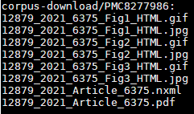
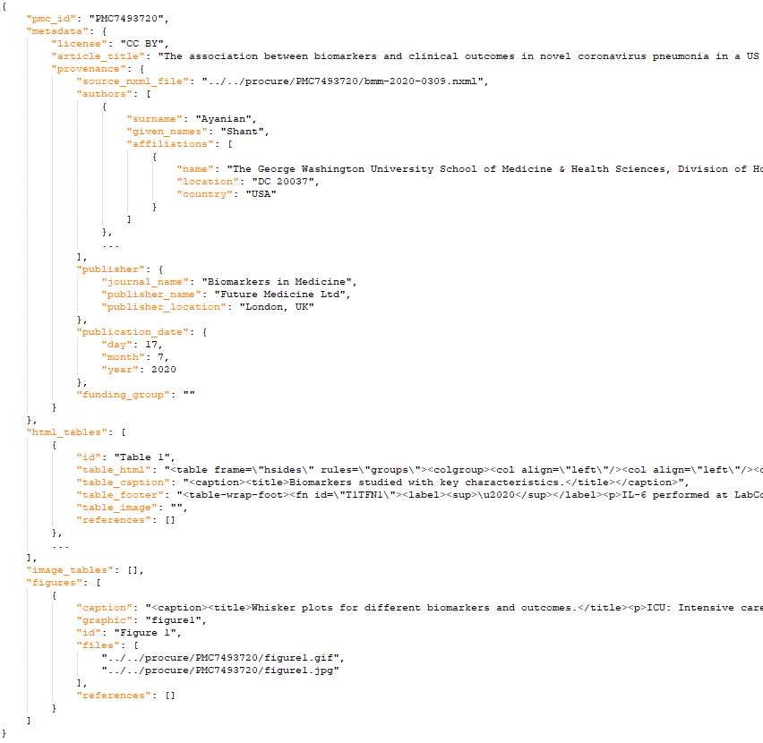

# corpusbuilder

This package contains code to build a corpus from PubMed Central (PMC) documents:
1. For given search terms, query PMC Search API for matching PMCIDs
2. Retrieve a document index file containing metadata (e.g. license, download location) for PMC articles
3. For each PMCID matching license requirements, a) retrieve document source files (e.g. .pdf, .nxml, and images) and b) extract table and image data into JSON format

## To set up Python environment

1. Install Anaconda (recommend Miniconda), open Anaconda prompt
2. Create a new conda environment: `conda create --name procure-conda python=3.7`
3. Activate the environment: `conda activate procure-conda`
4. Install pycurl dependency: `conda install -c anaconda pycurl`  (note: pycurl cannot be pip installed on Windows) (note: may need to install while outside of corporate firewall)
5. Install other dependencies: `pip install -r requirements.txt`
6. Install spaCy NLP model: `pip install https://github.com/explosion/spacy-models/releases/download/en_core_web_lg-3.1.0/en_core_web_lg-3.1.0.tar.gz` (if fails, download and pip install the tar.gz)


Note: if using Linux, an alternative option is to omit the conda environment, add pycurl==7.43.0.6 to requirements.txt, and install all dependencies via requirements.txt.

## To configure
The file config.ini contains configuration items:
```
Tool=ProCure                                      # tool name
Email=                                            # email address
MaxPMCIDs=10                                      # maximum number of PMCIDs to retrieve
PubMedFTPServer=ftp.ncbi.nlm.nih.gov              # PubMed FTP server   
PubMedFTPPath=pub/pmc/                            # PubMed FTP path
IndexFileName=oa_comm_use_file_list.csv           # PubMed document index file name
IndexFileCSVHeaders=Accession ID, File, License   # headers in document index file
IndexFileLocal=corpus/oa_comm_use_file_list.csv   # if not blank, use this local index file (instead of downloading)
CorpusDownloadDir=corpus-download/                # output folder for downloaded corpus
CorpusExtractDir=corpus-extract/                  # output folder for json files generated from corpus downloads
Proxy=                                            # http proxy for use by pycurl (if needed)
```
Note: Tool and Email are used for the PMCID search. Please change the email address to reflect the current user.  Tool may be changed if desired.

Note: when running behind a firewall, need to set proxy both in config file (as above) and at command line (e.g. HTTPS_PROXY).  Sample value is http://proxy.research.ge.com:80

## To download the corpus
```
python download_corpus.py -c CONFIG_FILE -s SEARCH_TERMS
```

Examples:
```
python download_corpus.py -c config.ini -s covid
python download_corpus.py -c config.ini -s "(covid)+AND+(gel%20electrophoresis)"
```

After running this command, find the downloaded corpus files in the corpus download directory (e.g. corpus-download/) specified in the config file.  Downloaded files include .pdf, .nxml, and image files associated with each document, as in this example:



## To extract table and image data from the corpus documents
```
python extract_corpus.py -c CONFIG_FILE -f INDEX_FILE
```

Examples:
```
python extract_corpus.py -c config.ini -f corpus-download/oa_comm_use_file_list.csv
```

After running this command, the extracted data is found in JSON files in the corpus extract directory (e.g corpus-extract/).  Sample JSON:



## To run unit tests

Run this from the top-level directory:
```
$ pytest
```

## Notes

_This research is based upon work supported by the Office of the Director of National Intelligence (ODNI), Intelligence Advanced Research Projects Activity (IARPA), via Contract # 2021-21022600004 (Proposal # GER Proposal #20-378 (258732))._

## Copyright, Licenses & Representations

The ProCure codebase is licensed under the BSD-3-Clause License as described in the LICENSE file. Installation and execution of the ProCure codebase requires the user to install certain Python packages which may be subject to different and/or additional open source license obligations and restrictions than that required under the ProCure Codebase.  The user is solely responsible for reviewing and complying with such open source license terms. 

Additionally, the ProCure codebase allows a user to download certain articles and metadata ("Content") from PubMed Central (PMC) via the PMC File Transfer Protocol (FTP) Bulk download Service. The Content that can be downloaded from PubMed using ProCure codebase are limited to those associated with the Creative Commons "CC BY" and "CC0" Licenses.  Any such Content obtained from PubMed Central (PMC) are provided by the respective publishers or authors. Articles in PMC usually include an explicit copyright statement. To see the details for any given record, see the "Copyright and License information" link on an article record. In the absence of a copyright statement, users should assume that standard copyright protection applies, unless the article contains an explicit statement to the contrary. In case of doubt, contact the journal publisher to verify the copyright status of an article. Users of PMC are directly and solely responsible for compliance with copyright restrictions and are expected to adhere to the terms and conditions defined by the copyright holder. Transmission, reproduction, or reuse of protected material, beyond the license terms or those allowed by the fair use principles of the copyright laws, requires the written permission of the copyright owners.

THIS SOFTWARE IS PROVIDED BY GENERAL ELECTRIC COMPANY "AS IS" AND ANY EXPRESS OR IMPLIED WARRANTIES, INCLUDING, BUT NOT LIMITED TO, THE IMPLIED WARRANTIES OF MERCHANTABILITY AND FITNESS FOR A PARTICULAR PURPOSE ARE DISCLAIMED. IN NO EVENT SHALL GENERAL ELECTRIC COMPANY BE LIABLE FOR ANY DIRECT, INDIRECT, INCIDENTAL, SPECIAL, EXEMPLARY, OR CONSEQUENTIAL DAMAGES (INCLUDING, BUT NOT LIMITED TO, PROCUREMENT OF SUBSTITUTE GOODS OR  SERVICES; LOSS OF USE, DATA, OR PROFITS; OR BUSINESS INTERRUPTION) HOWEVER CAUSED AND ON ANY THEORY OF LIABILITY, WHETHER IN CONTRACT, STRICT LIABILITY, OR TORT (INCLUDING NEGLIGENCE OR OTHERWISE) ARISING IN ANY WAY OUT OF THE USE OF THIS SOFTWARE, EVEN IF ADVISED OF THE POSSIBILITY OF SUCH DAMAGE
